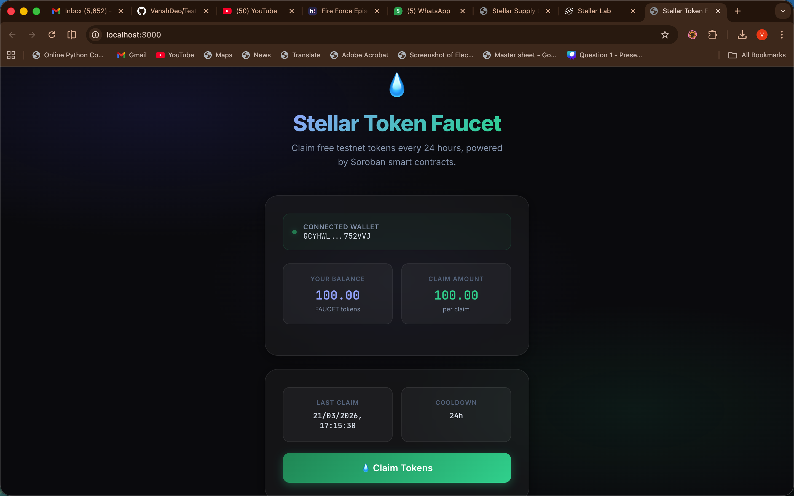
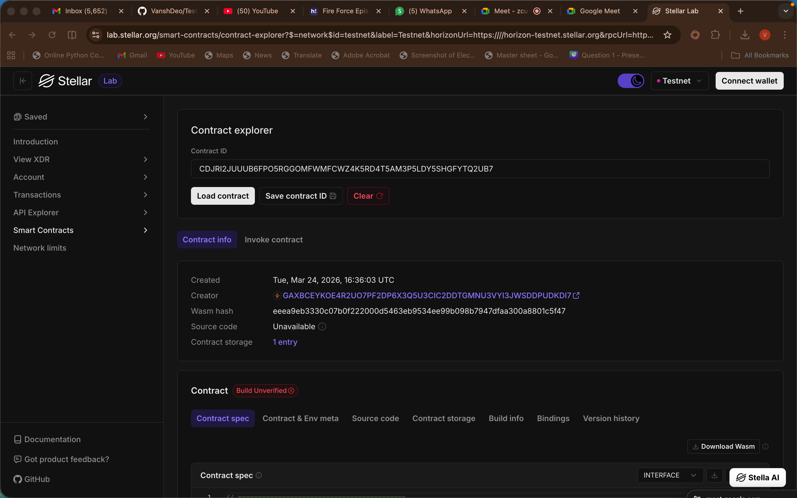

# 💧 Stellar Token Faucet

A full-stack Web3 dApp built with **Stellar Soroban** smart contracts (Rust) and a **React** frontend. Users can claim testnet tokens once every 24 hours via the **Freighter** wallet.

## 🌟 Overview
The Stellar Token Faucet provides an easy way for developers and users to obtain test tokens on the Stellar Testnet. This decentralized application prevents abuse by enforcing a 24-hour cooldown for every claimant, recorded immutably on-chain.

### Key Features
- **One-Click Claims**: Connect your Freighter wallet and claim tokens instantly.
- **Cooldown Enforcement**: Smart contract logic prevents double-claims within 24 hours.
- **Real-time Balance**: View the faucet’s remaining supply and your current wallet balance.
- **Immutable Logic**: Powered by Soroban's robust smart contract framework.

---

## 📸 Previews

### Dashboard Preview


### Stellar Labs Contract View


---

## ⛓️ Smart Contract Details
- **Network**: Stellar Testnet
- **Faucet Contract ID**: `CDJRI2JUUUB6FPO5RGGOMFWMFCWZ4K5RD4T5AM3P5LDY5SHGFYTQ2UB7`
- **Explorer Link**: [View on Stellar Expert](https://stellar.expert/explorer/testnet/contract/CDJRI2JUUUB6FPO5RGGOMFWMFCWZ4K5RD4T5AM3P5LDY5SHGFYTQ2UB7)

---

## 🚀 Getting Started

### Prerequisites
- [Rust](https://www.rust-lang.org/) & Cargo (for smart contract compilation)
- [Stellar CLI](https://developers.stellar.org/docs/tools/developer-tools)
- [Node.js](https://nodejs.org/) (v18+)
- **Freighter Wallet** browser extension.

### 1. Build and Test the Contract
```bash
# Compile to WebAssembly
stellar contract build

# Run automated unit tests
cargo test
```

### 2. Deployment
To deploy your own instance of the faucet, use the provided script:
```bash
bash scripts/deploy.sh
```
*Note: This script handles contract deployment, initialization of values, and populates the frontend configuration automatically.*

### 3. Start the Frontend
The clean, modern React dashboard lives in the `frontend/` directory.

```bash
cd frontend
npm install
npm run dev
```

The application typically starts on `http://localhost:3000`. Connect your Freighter wallet and ensure it's set to **Testnet** to begin claiming!

---

## 🛠️ Built With
- **[Soroban](https://soroban.stellar.org/)**: The smart contract platform for Stellar.
- **[React](https://reactjs.org/) & [Vite](https://vitejs.dev/)**: For a blazing fast developer experience.
- **[Stellar SDK](https://github.com/stellar/js-stellar-sdk)**: Powering the blockchain interactions.
